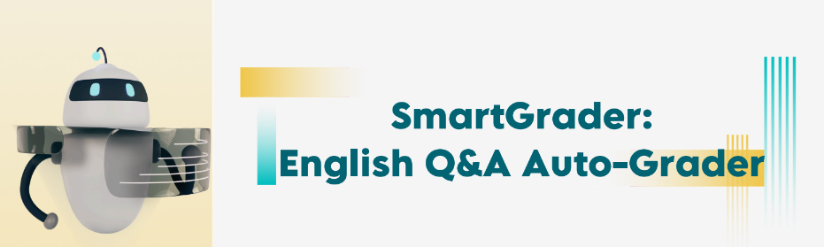
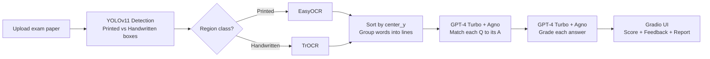

<p align="center">
  
</p>

<h1 align="center">📚 SmartGrader — English Q&A Auto-Grader</h1>

<p align="center">
  Snap a photo of a worksheet with <b>printed questions</b> and <b>handwritten answers</b>,<br/>
  and SmartGrader will detect, read, match, grade, and visualize the results — end to end.
</p>

<p align="center">
  
  
  
  
  
  
</p>

---

## 📋 Table of Contents

- [Overview](#-overview)
- [Result — Before & After](#-result--before--after)
- [How It Works](#-how-it-works)
  - [1. Detection — YOLOv11 on Roboflow](#1-detection--yolov11-on-roboflow)
  - [2. OCR — EasyOCR vs TrOCR](#2-ocr--easyocr-vs-trocr)
  - [3. Text Sorting & Grouping](#3-text-sorting--grouping)
  - [4. Q&A Matching — GPT-4 Turbo + Agno](#4-qa-matching--gpt-4-turbo--agno)
  - [5. Answer Grading — GPT-4 Turbo + Agno](#5-answer-grading--gpt-4-turbo--agno)
  - [6. User Interface — Gradio](#6-user-interface--gradio)
- [Tech Stack](#-tech-stack)
- [Project Structure](#-project-structure)
- [Getting Started](#-getting-started)
- [Usage](#-usage)
- [Results](#-results)
- [Limitations & Future Work](#-limitations--future-work)
- [Links](#-links)
- [Team](#-team)
- [License](#-license)

---

## 🎯 Overview

**SmartGrader** is an AI grading system that reads exam papers, grades student answers, and returns a short, encouraging feedback report. It was built to explore two use cases:

- **AI-assisted grading** — reduce the manual effort of grading short-answer questions.
- **Self-testing & feedback** — let students check their own answers and get instant, concept-focused feedback.

The full pipeline is contained in a single Colab-ready notebook and ships with an interactive **Gradio** web app.



---

## 🔄 Result — Before & After

<table>
<tr>
<td width="50%" align="center"><b>📤 Before — student worksheet</b></td>
<td width="50%" align="center"><b>📥 After — AI-graded result</b></td>
</tr>
<tr>
<td align="center"></td>
<td align="center"></td>
</tr>
</table>

> SmartGrader detects the printed questions and handwritten answers, matches each Q to its A, then returns a letter grade, per-question scores, and short feedback.

---

## ⚙️ How It Works

The pipeline has four AI stages (detection → OCR → matching → grading) wrapped in a Gradio UI.

### 1. Detection — YOLOv11 on Roboflow

A **YOLOv11 object detection** model (trained and hosted on **Roboflow**) locates every word on the page and classifies it as **`Printed`** or **`Handwritten`**. Training our own model on Colab under-performed, so the notebook loads the hosted Roboflow model directly (`project.version(6).model`) for better and more consistent detection.

**Dataset — `Hand_print_FRCNN`**

| Item | Detail |
|---|---|
| Classes | `Printed`, `Handwritten` |
| Original samples | 58 images |
| Preprocessing | Auto-orient, resize to 640×640 (stretch), grayscale, auto-contrast |
| Augmentation | 3 outputs/image · zoom/crop 0–20% · brightness ±15% · blur ≤1.5px · noise ≤0.26% |
| Data split | Train 123 (89%) · Valid 9 (7%) · Test 6 (4%) |

**Model performance (validation set)**

| mAP@50 | Precision | Recall |
|:---:|:---:|:---:|
| 63.1% | 63.9% | 63.6% |

### 2. OCR — EasyOCR vs TrOCR

Because the detector returns **word-level boxes**, each box is cropped and read by the OCR engine best suited to its class:

| | **EasyOCR** | **TrOCR** |
|---|---|---|
| Type | Python OCR library | Transformer-based (Microsoft, `microsoft/trocr-base-handwritten`) |
| Best for | **Printed** text | **Handwritten** text (also handles printed) |
| Speed | Lightweight & fast on CPU | Heavier & slower — best on **GPU** |
| Role in SmartGrader | Reads printed questions | Reads handwritten answers |

Each crop is padded and contrast-enhanced before OCR to improve accuracy on small regions.

### 3. Text Sorting & Grouping

Word-level OCR alone gives scattered fragments. To rebuild readable questions and answers, all detected boxes are:

1. **Sorted by vertical center (`center_y`)** from top to bottom.
2. **Grouped into lines** using a vertical threshold (`line_threshold = 50`).
3. **Ordered left → right** within each line by `center_x`.
4. **Joined** into full-sentence question and answer blocks, each tagged with its `y_position`.

This spatial layout (the `y_position` of every block) is later fed to the LLM so it can match on *both* content **and** position on the page.

### 4. Q&A Matching — GPT-4 Turbo + Agno

An **[Agno](https://github.com/agno-agi/agno)** agent (a framework for building and orchestrating AI agents) powered by **GPT-4 Turbo** receives the detected questions and answers *with their vertical positions* and pairs each question with its most likely answer, using content relevance, spatial proximity (answers usually appear below questions), and logical connection.

The agent returns strict JSON:

```json
{
  "qa_pairs": [
    {
      "question_number": 1,
      "question": "What is Machine Learning?",
      "answer": "Machine Learning is the ability to make the machine learn without being explicitly programmed."
    },
    {
      "question_number": 2,
      "question": "What are the 2 common types of ML?",
      "answer": "1 - Supervised Learning, 2 - Unsupervised Learning"
    }
  ]
}
```

A position-based fallback runs automatically if the LLM response can't be parsed.

### 5. Answer Grading — GPT-4 Turbo + Agno

A second **Agno + GPT-4 Turbo** agent grades each matched pair as a *kind, encouraging teacher*. Its scoring rubric is intentionally **lenient and concept-focused**:

- Ignores spelling/grammar entirely — grades on core concepts.
- 80–100% if the core concept is understood, 60–79% partial, 40–59% attempted, 0–39% wrong.
- Returns a `Score`, one encouraging `Feedback` sentence, and `Key_Points`.

Per-question scores are aggregated into an overall percentage and a letter grade (**A–F**).

### 6. User Interface — Gradio

An interactive **Gradio** app ties everything together:

- **🔍 Smart Detection** — Roboflow YOLOv11 finds printed questions & handwritten answers
- **🧩 Intelligent Matching** — LLM pairs questions with their answers
- **📄 Dual OCR** — EasyOCR for printed, TrOCR for handwritten
- **🤖 AI Grading** — GPT-4 Turbo scores answers and writes feedback
- **📊 Comprehensive Reports** — visual score breakdown + per-question feedback

Two adjustable controls are exposed: **Max score per question** and **Detection confidence**.

---

## 🧰 Tech Stack

| Layer | Tools |
|---|---|
| Detection | YOLOv11 · Roboflow |
| OCR | EasyOCR · TrOCR (`transformers`) |
| LLM / Agents | GPT-4 Turbo (OpenAI) · Agno |
| Vision / Utils | OpenCV · Pillow · NumPy · Matplotlib |
| Deep Learning | PyTorch · Torchvision |
| Interface | Gradio |

---

## 📁 Project Structure

```text
SmartGrader/
├── Final_CV_SmartGrader_Project.ipynb   # End-to-end pipeline (Colab-ready)
├── requirements.txt
├── .env.example                         # Template for API keys
├── assets/
│   ├── logo.png
│   ├── before.png
│   └── after.png
└── README.md
```

---

## 🚀 Getting Started

### Prerequisites

- **Python 3.10+**
- A **GPU is strongly recommended** (TrOCR and the OCR loop are slow on CPU). Google Colab with a GPU runtime works great.
- A **Roboflow** account/API key (to access the hosted detection model)
- An **OpenAI** API key (for GPT-4 Turbo matching & grading)

### 1. Clone the repo

```bash
git clone https://github.com/<your-username>/SmartGrader.git
cd SmartGrader
```

### 2. Install dependencies

```bash
pip install -r requirements.txt
```

<details>
<summary><code>requirements.txt</code></summary>

```text
gradio
easyocr
transformers
torch
torchvision
opencv-python
pillow
matplotlib
numpy
roboflow
sentencepiece
agno
openai
```
</details>

### 3. Configure API keys (do **not** hardcode them)

> ⚠️ **Security:** never commit real API keys to a public repo. Automated scrapers harvest leaked OpenAI keys from GitHub within minutes. Keep keys in environment variables and add `.env` to your `.gitignore`.

Create a `.env` file from the template:

```bash
cp .env.example .env
```

```dotenv
# .env
OPENAI_API_KEY=your_openai_key_here
ROBOFLOW_API_KEY=your_roboflow_key_here
```

Then load them in the notebook instead of pasting the values inline:

```python
import os
from dotenv import load_dotenv
load_dotenv()

OPENAI_API_KEY   = os.getenv("OPENAI_API_KEY")
ROBOFLOW_API_KEY = os.getenv("ROBOFLOW_API_KEY")
```

---

## 🧪 Usage

### Option A — Run the notebook (recommended)

1. Open `Final_CV_SmartGrader_Project.ipynb` in **Google Colab** (GPU runtime) or Jupyter.
2. Run the setup cells to install packages and load the Roboflow model + OCR models.
3. Run the final cell to launch the Gradio app.

### Option B — Launch the Gradio app

The final notebook cell builds and launches the interface:

```python
demo.launch(
    share=True,
    server_name="0.0.0.0",
    server_port=7860,
)
```

Open the printed URL, upload a Q&A paper, set the **max score per question** and **detection confidence**, then hit **🎯 Grade Paper**.

---

## 📊 Results

On the demo worksheet (2 questions), SmartGrader detected both questions and answers, matched them correctly, and graded them:

| Question | Score | Feedback |
|---|:---:|---|
| What is Machine Learning? | 10/10 | Great definition that captures the core idea |
| What are the 2 common types of ML? | 10/10 | Correct — those are the two standard categories |
| **Total** | **20/20 (A)** | |

---

## 🧭 Limitations & Future Work

- **Detection accuracy (~63% mAP@50)** is capped by the small dataset (58 base images). Collecting and labeling more samples is the single highest-impact improvement.
- **Handwriting OCR** still misreads messy strokes; the LLM matching step cleans up some — but not all — OCR noise.
- **GPU dependency** — TrOCR + the per-word OCR loop are slow on CPU; batching OCR calls would speed things up.
- **Cost & latency** — two GPT-4 Turbo calls per paper. A cheaper model (or a local LLM) could handle matching, reserving the stronger model for grading.
- **Lenient grading** is great for self-testing but would need a stricter rubric for high-stakes exams.

---

## 🔗 Links

- 🎥 **Full Guide (Video):** _add link_
- 📓 **Colab Notebook:** _add link_
- 📑 **Slides:** _add link_

---

## 👥 Team

- **Yasir Alharbi**
- **Naif Alharbi**
- **Sultan Alaqili**

---

## 📄 License

Released under the **MIT License**. See [`LICENSE`](LICENSE) for details.
